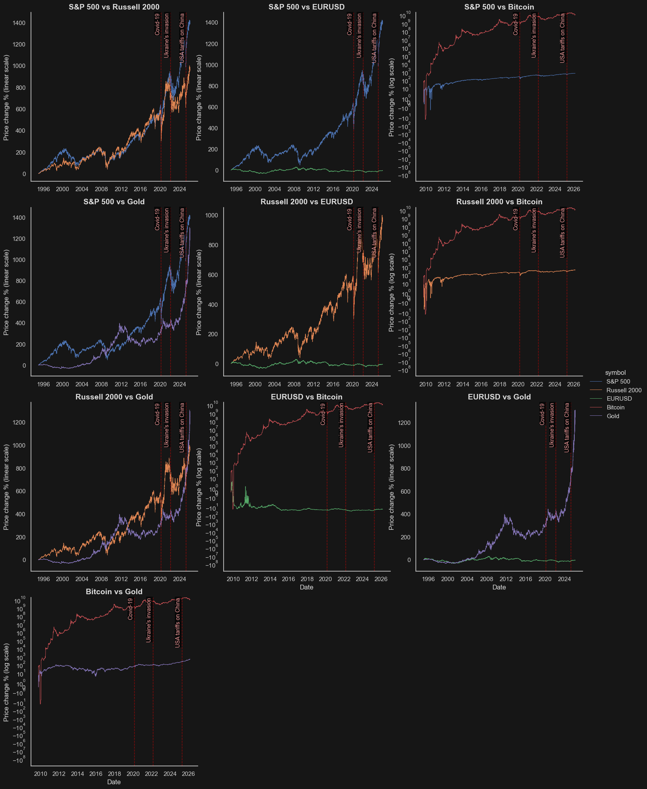
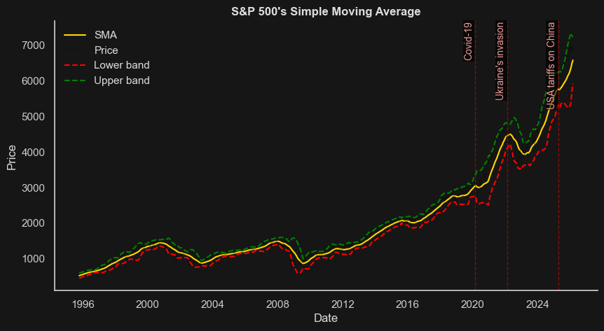
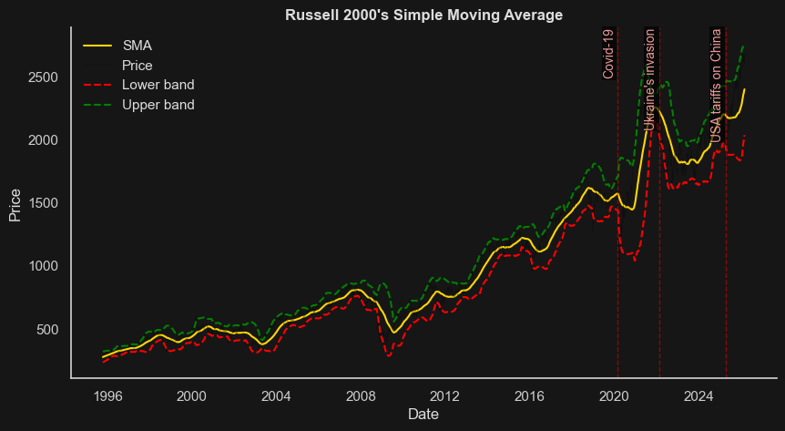
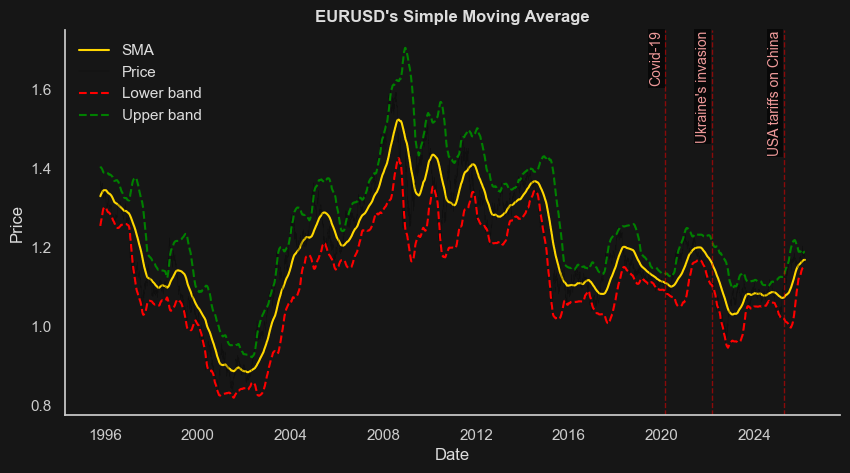
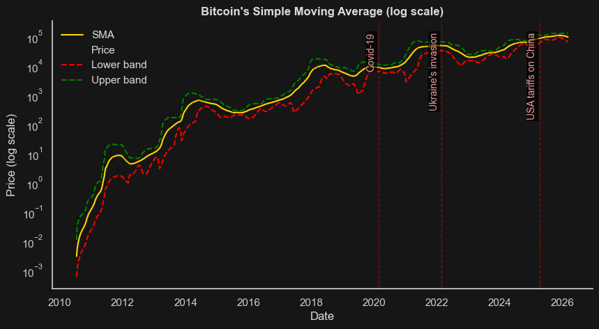
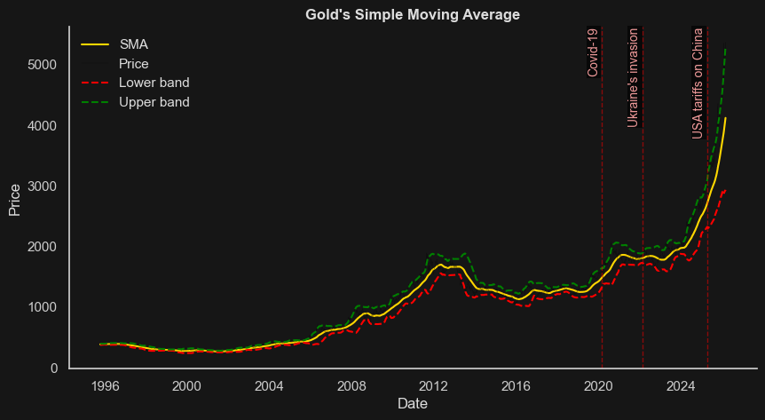

# Correlation Analysis Between Selected Financial Instruments

This analysis aims to demonstrate whether there are any correlations between the prices of certain financial instruments (stock indices, commodities, cryptocurrencies, currency pairs).


```python
from src.plotting import sma_change_plot
from src.data_loader import DataManager
from src.plotting import comparison_plot

x = DataManager('../database_2026-03-04')

x.load_everything()


combinations = [
    ("S&P 500", "Russell 2000"), ("S&P 500", "EURUSD"), ("S&P 500", "Bitcoin"), ("S&P 500", "Gold"),
    ("Russell 2000", "EURUSD"), ("Russell 2000", "Bitcoin"), ("Russell 2000", "Gold"),
    ("EURUSD", "Bitcoin"), ("EURUSD", "Gold"),
    ("Bitcoin", "Gold")
]

comparison_plot(x.close_prices, combinations)

```


    

    


```
symbols_list = ['S&P 500', 'Russell 2000',  'EURUSD',  'Bitcoin', 'Gold']

sma_change_plot(x.close_prices, symbols_list)
```


    

    


    

    


    

    


    

    


    

    


```
from src.investment_strategy_simulation import investment_strategy_sim
symbols_list = ["Brent Crude Oil", "Gold", "Silver", "Bitcoin", "Ethereum", "USDPLN", "Dow Jones", "S&P 500",
     "NASDAQ", "Russell 2000", "VIX"]

investment_strategy_sim(x.close_prices, symbols_list)

```


<div>
<style scoped>
    .dataframe tbody tr th:only-of-type {
        vertical-align: middle;
    }

    .dataframe tbody tr th {
        vertical-align: top;
    }

    .dataframe thead th {
        text-align: right;
    }
</style>
<table border="1" class="dataframe">
  <thead>
    <tr style="text-align: right;">
      <th></th>
      <th>symbol</th>
      <th>Total invested PLN</th>
      <th>Final investment value</th>
      <th>Final profit</th>
      <th>Final profit_perc</th>
    </tr>
  </thead>
  <tbody>
    <tr>
      <th>2</th>
      <td>Silver</td>
      <td>9000.0</td>
      <td>18264.05</td>
      <td>9264.05</td>
      <td>102.93</td>
    </tr>
    <tr>
      <th>1</th>
      <td>Gold</td>
      <td>9000.0</td>
      <td>13248.05</td>
      <td>4248.05</td>
      <td>47.20</td>
    </tr>
    <tr>
      <th>0</th>
      <td>Brent Crude Oil</td>
      <td>9000.0</td>
      <td>10399.41</td>
      <td>1399.41</td>
      <td>15.55</td>
    </tr>
    <tr>
      <th>9</th>
      <td>Russell 2000</td>
      <td>9000.0</td>
      <td>10078.64</td>
      <td>1078.64</td>
      <td>11.98</td>
    </tr>
    <tr>
      <th>10</th>
      <td>VIX</td>
      <td>9000.0</td>
      <td>9966.51</td>
      <td>966.51</td>
      <td>10.74</td>
    </tr>
    <tr>
      <th>8</th>
      <td>NASDAQ</td>
      <td>9000.0</td>
      <td>9830.26</td>
      <td>830.26</td>
      <td>9.23</td>
    </tr>
    <tr>
      <th>7</th>
      <td>S&amp;P 500</td>
      <td>9000.0</td>
      <td>9662.05</td>
      <td>662.05</td>
      <td>7.36</td>
    </tr>
    <tr>
      <th>6</th>
      <td>Dow Jones</td>
      <td>9000.0</td>
      <td>9538.17</td>
      <td>538.17</td>
      <td>5.98</td>
    </tr>
    <tr>
      <th>5</th>
      <td>USDPLN</td>
      <td>9000.0</td>
      <td>8502.06</td>
      <td>-497.94</td>
      <td>-5.53</td>
    </tr>
    <tr>
      <th>3</th>
      <td>Bitcoin</td>
      <td>9000.0</td>
      <td>7154.48</td>
      <td>-1845.52</td>
      <td>-20.51</td>
    </tr>
    <tr>
      <th>4</th>
      <td>Ethereum</td>
      <td>9000.0</td>
      <td>7028.15</td>
      <td>-1971.85</td>
      <td>-21.91</td>
    </tr>
  </tbody>
</table>
</div>


```

```
